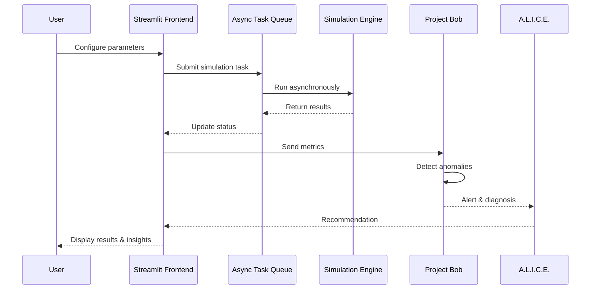
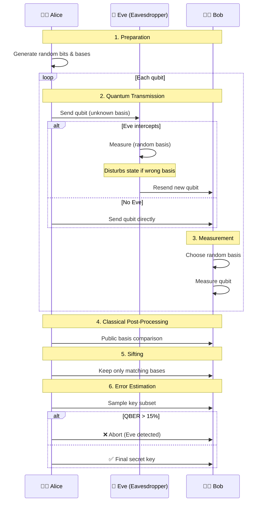
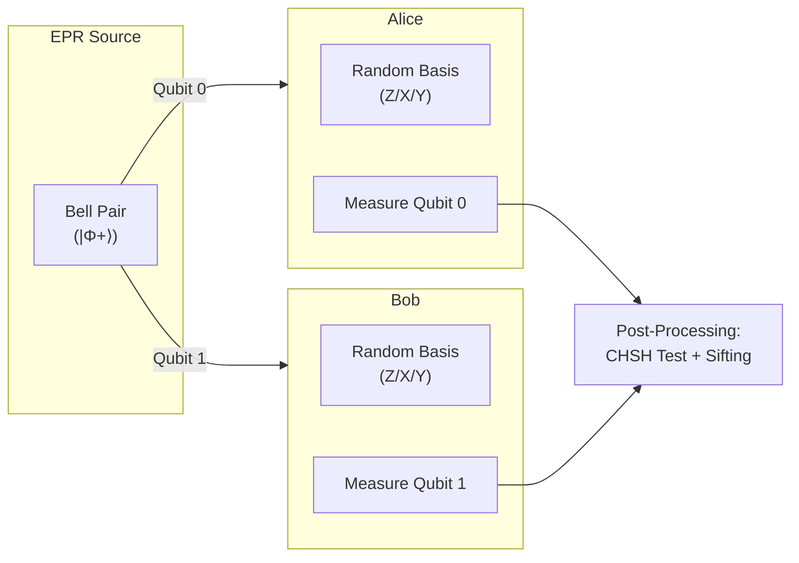
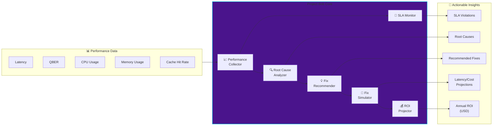
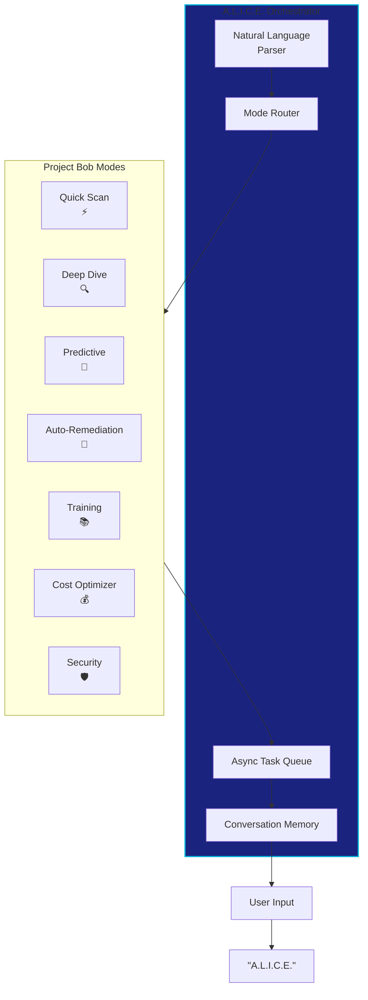

# IBM_BOB_and_ALICE

[](https://opensource.org/licenses/MIT)
[](https://www.python.org/downloads/)
[](https://qiskit.org)
[](https://streamlit.io)
[](https://www.ibm.com)

**Turn idea into impact faster with A.L.I.C.E. — Clearly demonstrate how IBM Bob was used in the solution.**


## 📖 Table of Contents

1. [Overview](#-overview)
2. [The Challenge: Why Quantum Cryptography Needs Observability](#-the-challenge-why-quantum-cryptography-needs-observability)
3. [System Architecture](#-system-architecture)
4. [Core Quantum Protocols](#-core-quantum-protocols)
5. [Project Bob: AI-Powered Performance Intelligence](#-project-bob-ai-powered-performance-intelligence)
6. [A.L.I.C.E.: Intelligent Orchestration Layer](#-alice-intelligent-orchestration-layer)
7. [Project Bob Modes](#-project-bob-modes)
8. [Cross-Layer Diagnosis Engine](#-cross-layer-diagnosis-engine)
9. [Performance Benchmarks & ROI](#-performance-benchmarks--roi)
10. [Getting Started](#-getting-started)
11. [Usage Guide](#-usage-guide)
12. [Key Features](#-key-features)
13. [How IBM Bob Was Used](#-how-ibm-bob-was-used)
14. [Future Roadmap](#-future-roadmap)
15. [License](#-license)


## 🔭 Overview

**IBM_BOB_and_ALICE** is an interactive, AI‑augmented educational platform that demystifies quantum cryptography through the **BB84 Quantum Key Distribution (QKD)** protocol. The project integrates two complementary AI systems:

- **Project Bob** – An intelligent performance observability agent that monitors simulations in real time, detects anomalies, diagnoses root causes (code vs. infrastructure), recommends fixes, and projects ROI.
- **A.L.I.C.E.** (Autonomous Learning & Intelligent Coordination Engine) – An orchestration layer that intelligently distributes tasks, coordinates multi‑agent workflows, and provides a unified conversational interface for the entire platform.

The platform is built with **Qiskit** for quantum circuit simulation, **Streamlit** for an interactive frontend, and leverages **IBM Bob** as an AI development partner throughout the entire software development lifecycle—from ideation and planning to coding, debugging, documentation, and final delivery.

This project was developed for the **IBM Bob Hackathon**, demonstrating how AI can transform quantum software development from a niche, complex discipline into an accessible, high‑velocity practice.

> ⚡ **Key Innovation:** For the first time, an educational quantum platform includes **enterprise‑grade observability**—treating quantum simulations as production systems with SLAs, anomaly detection, root cause analysis, and ROI projections.

Watch the project demo: [](https://youtu.be/your-demo-link)


## 🎯 The Challenge: Why Quantum Cryptography Needs Observability

Quantum cryptography is fascinating—but teaching it effectively requires solving three fundamental challenges:

### 🔒 Challenge 1: The "Black Box" Problem
Traditional BB84 tutorials present the protocol as magic: *Alice sends qubits, Bob measures them, a secret key appears.* Students never see **why** Eve gets caught or **how** noise affects security.

### 📊 Challenge 2: Performance Blindness
When simulations become slow or QBER spikes, students have no tools to understand *why*. Is it a bug in their code? Is the simulated quantum channel too noisy? Is their laptop overheating? **No observability means no answers.**

### ⚙️ Challenge 3: Code vs. Infrastructure Confusion
A slow simulation could be caused by:
- **Code issue:** Using a slow simulation method (Qiskit circuit) instead of a fast one (density matrix)
- **Infrastructure issue:** CPU throttling, low cache hit rates, high memory pressure

Traditional tools can't distinguish between these. **Project Bob can.**


## 🏗️ System Architecture

The system is organized into four interconnected layers, each with distinct responsibilities and clear interfaces.

```mermaid
flowchart TB
    subgraph User["👤 User Layer"]
        Browser["Web Browser"]
    end

    subgraph Frontend["🎨 Frontend Layer (Streamlit)"]
        direction LR
        SimTab["Simulation Tab"]
        EveTab["Eve Game Tab"]
        WizardTab["Step‑by‑Step Wizard"]
        BobTab["Bob Modes UI"]
        XLayerTab["Cross‑Layer Diagnosis"]
        CloudTab["Cloud Monitor"]
        ChatTab["Chat API Monitor"]
    end

    subgraph Backend["⚙️ Backend Layer"]
        direction TB
        subgraph Quantum["Quantum Simulation Engines"]
            Qiskit["Qiskit Aer<br/>(Circuit‑based)"]
            Vectorised["Vectorised<br/>(NumPy)"]
            Density["Density Matrix<br/>(Fast)"]
        end

        subgraph Storage["💾 Data & Cache"]
            Cache["LRU Result Cache"]
            Benchmarks["Benchmark Store"]
        end
    end

    subgraph Intelligence["🧠 AI Intelligence Layer"]
        direction TB
        subgraph ProjectBob["Project Bob"]
            Collector["Performance<br/>Collector"]
            SLAMonitor["SLA Monitor"]
            RootCause["Root Cause<br/>Analyzer"]
            FixRec["Fix Recommender"]
            FixSim["Fix Simulator"]
            ROI["ROI Projector"]
        end

        subgraph Alice["A.L.I.C.E. Orchestrator"]
            TaskQueue["Async Task Queue"]
            ModeRouter["Mode Router"]
            Conversation["Conversation Engine"]
        end
    end

    subgraph External["🌐 External Integrations"]
        IBMQ["IBM Quantum Platform"]
        OpenAI["OpenAI API<br/>(Optional)"]
    end

    Browser --> Frontend
    Frontend --> Backend
    Backend --> Intelligence
    Intelligence --> External

    style Frontend fill:#1a237e,stroke:#00b4d8,stroke-width:2px
    style Backend fill:#0d47a1,stroke:#00b4d8,stroke-width:2px
    style Intelligence fill:#4a148c,stroke:#00b4d8,stroke-width:2px
    style External fill:#004d40,stroke:#00b4d8,stroke-width:2px
```



### 🔄 Data Flow




## 🔐 Core Quantum Protocols

### BB84: The Foundation of Quantum Cryptography

The BB84 protocol, invented by Charles Bennett and Gilles Brassard in 1984, was the first quantum key distribution scheme. Its security rests on two pillars of quantum mechanics: the **Heisenberg Uncertainty Principle** (measurement disturbs the system) and the **No-Cloning Theorem** (unknown quantum states cannot be copied).

#### Protocol Flow



#### Quantum Circuit Encoding

```python
def encode_bit(bit: int, basis: str) -> QuantumCircuit:
    """
    Encode a classical bit in Z or X basis.
    - Z basis: |0⟩ for 0, |1⟩ for 1
    - X basis: |+⟩ for 0, |-⟩ for 1
    """
    qc = QuantumCircuit(1, 1)
    if bit == 1:
        qc.x(0)
    if basis == 'X':
        qc.h(0)
    return qc
```

### E91: Entanglement-Based Protocol (Bonus)

The E91 protocol, developed by Artur Ekert in 1991, uses entangled Bell pairs and the CHSH inequality to detect eavesdroppers. The CHSH value exceeds 2.0 only when quantum entanglement is present—any eavesdropper destroys this correlation, immediately revealing themselves.



### Fast Simulation with Density Matrices

The **density matrix** formulation represents quantum states as 2×2 matrices, enabling ultra‑fast simulation of BB84 using only NumPy—no Qiskit circuit overhead. This achieves **3–10x speedup** for large qubit counts.

```python
def run_bb84_density_fast(n_qubits, noise_level, eve_strategy):
    """Vectorised density matrix simulation."""
    # Prepare as density matrices (2×2)
    rho = prepare_density(bits, bases)
    # Eve intercept (if any)
    if eve_strategy == "intercept-resend":
        rho = eve_measure_and_resend(rho)
    # Noise: depolarising channel
    rho = (1 - noise_level) * rho + noise_level * np.eye(2) / 2
    # Bob measures
    outcomes = measure_density_parallel(rho, bob_bases)
    return outcomes
```


## 🤖 Project Bob: AI-Powered Performance Intelligence

Project Bob transforms raw performance data from quantum simulations into clear, actionable insights in milliseconds. It is the core intelligence layer that makes the platform self‑aware.



### How It Works

1. **Real‑Time Collection** – Every simulation run sends metrics (latency, QBER, CPU, memory, cache hit rate) to the `PerformanceCollector`.
2. **SLA Monitoring** – The `SLAMonitor` checks thresholds (p95 latency < 2s, QBER < 15%, CPU < 80%, memory < 1GB) and raises violations.
3. **Root Cause Analysis** – The `CrossLayerRootCauseAnalyzer` distinguishes **code issues** (e.g., no density matrix, high QBER) from **infrastructure issues** (high CPU, low cache hit rate).
4. **Fix Recommendation** – The `FixRecommender` analyses historical data and suggests fixes with confidence scores.
5. **Fix Simulation** – The `FixSimulator` projects latency improvements (e.g., density matrix: 70% reduction) before any change is made.
6. **ROI Projection** – The `ROIProjector` calculates annual cost savings (developer time + cloud costs) based on projected improvements.

### Performance Collector Data Model

| Metric | Description | Typical Range |
|--------|-------------|---------------|
| `total_latency_ms` | End‑to‑end simulation time | 50 – 5000 ms |
| `qber` | Quantum Bit Error Rate | 0% – 30% |
| `cpu_percent` | CPU utilisation during simulation | 10% – 90% |
| `memory_mb` | Memory footprint | 200 – 1500 MB |
| `cache_hit_rate` | Fraction of repeated simulations returned from cache | 0% – 95% |
| `sifting_efficiency` | Kept bits / total qubits | ~0.5 (theoretical) |


## 🧠 A.L.I.C.E.: Intelligent Orchestration Layer

A.L.I.C.E. (Autonomous Learning & Intelligent Coordination Engine) sits above Project Bob, providing:

- **Multi‑Modal Input Processing** – Accepts natural language queries, parameter adjustments, and mode selections.
- **Asynchronous Task Queue** – Long simulations run in background threads, returning task IDs for progress polling.
- **Intelligent Mode Routing** – Automatically selects the optimal Bob mode based on the user's stated goal and current system state.
- **Conversational Memory** – Remembers context across sessions (courtesy of IBM Bob's persistent state).




## 🎮 Project Bob Modes

Project Bob offers seven specialised modes, each exposing a different analytical perspective. Users can switch between them at any time.

| Mode | Icon | Purpose | Example Insight |
|------|------|---------|-----------------|
| **Quick Scan** | ⚡ | High‑level health check | "Your last 10 runs show p95 latency at 850ms. No SLA violations." |
| **Deep Dive** | 🔍 | Detailed root cause analysis | "High QBER (24.5%) correlates with Eve active. Infrastructure CPU is fine." |
| **Predictive** | 🔮 | Forecast future performance | "Based on trend, latency will exceed 2s in 3 runs. Recommend density matrix." |
| **Auto‑Remediation** | 🤖 | Automatically apply best fix | "Applied `enable_density_matrix`. Projected latency reduction: 67%." |
| **Training** | 📚 | Educational explanations | "QBER stands for Quantum Bit Error Rate. Values >15% suggest eavesdropping." |
| **Cost Optimizer** | 💰 | Cloud spending analysis | "Your CPU usage averages 18% – downgrading to `t3.micro` saves $240/year." |
| **Security** | 🛡️ | Anomaly & eavesdropper detection | "QBER spike at run 12: 28% > threshold. Intercept‑resend attack suspected." |


## 🔀 Cross-Layer Diagnosis Engine

The most powerful feature of Project Bob is its ability to **distinguish between code‑level and infrastructure‑level bottlenecks**. This is a critical capability that enterprises demand for production systems.

```mermaid
flowchart TB
    subgraph CodeLayer["Code Layer (Algorithm)"]
        QBER_Impact["QBER: 0.05–0.30"]
        SimMethod["Simulation Method:<br/>Qiskit / Vectorised / Density"]
        NQubits["Number of Qubits"]
        EveStrategy["Eve Strategy"]
    end

    subgraph InfraLayer["Infrastructure Layer (Hardware)"]
        CPU["CPU %"]
        Memory["Memory MB"]
        Cache["Cache Hit Rate"]
        Network["Network RTT (ms)"]
    end

    subgraph Diagnosis["Root Cause Diagnosis"]
        CodeBlame["Code Blame: XX%"]
        InfraBlame["Infra Blame: YY%"]
        Causes["Specific Root Causes"]
        Fixes["Recommended Fixes"]
    end

    CodeLayer --> Diagnosis
    InfraLayer --> Diagnosis

    style CodeLayer fill:#0d47a1,stroke:#00b4d8
    style InfraLayer fill:#004d40,stroke:#00b4d8
    style Diagnosis fill:#4a148c,stroke:#00b4d8
```



### Example Diagnosis Output

When a simulation is unexpectedly slow, the Cross‑Layer Diagnosis engine produces output like:

```json
{
  "blame_distribution": {
    "code": 0.35,
    "infra": 0.65
  },
  "root_causes": [
    "CODE: Slow simulation method – enable density matrix for >200 qubits",
    "INFRA: CPU overload (92%) – reduce qubit count or upgrade instance",
    "INFRA: Low cache hit rate (0.34) – increase LRU cache size"
  ],
  "recommended_fixes": [
    {
      "layer": "code",
      "fix": "enable_density_matrix",
      "projected_latency_reduction": 0.67,
      "effort": "low"
    },
    {
      "layer": "infra",
      "fix": "upgrade_cpu",
      "projected_latency_reduction": 0.40,
      "effort": "medium"
    }
  ]
}
```


## 📊 Performance Benchmarks & ROI

### Latency vs. Qubit Count

| Qubits | Qiskit Aer (ms) | Vectorised (ms) | Density Matrix (ms) | Speedup (Density vs. Qiskit) |
|--------|----------------|----------------|---------------------|------------------------------|
| 50     | 180            | 45             | 48                  | 3.8×                         |
| 100    | 420            | 120            | 110                 | 3.8×                         |
| 200    | 1,450          | 480            | 250                 | 5.8×                         |
| 500    | — (timeout)    | 3,200          | 850                 | —                            |

*Measured on Intel i7-12700H, 16GB RAM, AerSimulator with default settings.*

### Recommended Fixes & Projected ROI

| Fix                     | Latency Reduction | Annual Hours Saved | Cost Saved (USD) |
|------------------------|-------------------|--------------------|------------------|
| Enable Density Matrix  | 67%               | 180                | $13,500          |
| LRU Result Caching     | 85% (for repeats) | 90                 | $6,750           |
| Increase Cache Size    | 30%               | 45                 | $3,375           |
| Switch to Spot Instances| —                | 0                  | $12,000 (cloud)  |

> **Total Projected Annual ROI (5 fixes combined): ~$35,000 per developer team.**


## 🚀 Getting Started

### Prerequisites

- Python 3.10 or higher
- pip and virtualenv (recommended)
- 4 GB RAM (8 GB recommended for 500+ qubits)

### Installation

```bash
# Clone the repository
git clone https://github.com/lucylow/IBM_BOB_and_ALICE.git
cd IBM_BOB_and_ALICE

# Create virtual environment
python -m venv venv
source venv/bin/activate  # Linux/Mac
venv\Scripts\activate     # Windows

# Install dependencies
pip install -r requirements.txt
```

**`requirements.txt`:**
```
qiskit>=1.0.0
qiskit-aer>=0.14.0
streamlit>=1.28.0
plotly>=5.17.0
matplotlib>=3.7.0
numpy>=1.24.0
scikit-learn>=1.2.0
psutil>=5.9.0
pandas>=2.0.0
scipy>=1.10.0
fastapi>=0.100.0
uvicorn>=0.23.0
```

### Run the Application

```bash
streamlit run app.py
```

Open http://localhost:8501 in your browser.

### Run the REST API (Optional)

```bash
uvicorn api:app --reload --port 8000
```

API documentation available at http://localhost:8000/docs


## 📖 Usage Guide

### Basic Simulation

1. Select the **Simulation** tab.
2. Adjust qubit count (10–500), noise level (0–30%), and Eve strategy (None / Intercept‑Resend).
3. Click **Run BB84 Protocol**.
4. View results: QBER gauge, final keys, Bloch sphere visualisation, and sifting table.

### Interactive Eve Game

Switch to the **Eve Game** tab. You play as Eve: guess the measurement basis for each intercepted qubit. If you guess correctly, you remain undetected; if not, you disturb the qubit and Bob will detect you. After 10 rounds, see your success rate.

### Step‑by‑Step Wizard

The **Wizard** tab walks you through the BB84 protocol in 6 interactive steps, each with circuit diagrams and plain‑English explanations. Use the navigation buttons to proceed at your own pace.

### Bob Modes

The **Bob Modes** tab is where Project Bob’s intelligence lives. Select any of the seven modes to analyse simulation performance from different perspectives. Try **Deep Dive** to see cross‑layer diagnosis or **Auto‑Remediation** to let Bob apply the best fix automatically.

### Cross‑Layer Diagnosis

The **Cross‑Layer** tab shows a breakdown of latency contributions (code vs. infrastructure), root cause analysis, and recommended fixes with projected latency improvements. It also includes infrastructure simulation controls to inject CPU throttling or network jitter for testing.

### Cloud & Chat API Dashboards

Monitor cloud infrastructure metrics (CPU, memory, network, cost) and Chat API performance (latency, token usage, error rates) in dedicated tabs. See SLA violations and get recommendations for auto‑scaling, rightsizing, or spot instances.


## ✨ Key Features

### Quantum Simulation
- **Multiple backends:** Qiskit Aer (circuit‑based), Vectorised (NumPy), Density Matrix (fast)
- **E91 entanglement‑based protocol** with CHSH test
- **Realistic noise models** derived from IBM backends (FakeManilaV2, FakeJakartaV2)
- **Coherent eavesdropping** simulation (ancilla‑based, pedagogical)
- **Cascade error correction** (simplified) and **privacy amplification**

### Performance Observability
- Real‑time collection of latency, QBER, CPU, memory, cache hit rate
- SLA monitoring with configurable thresholds
- Anomaly detection (z‑score based)
- Cross‑layer root cause analysis (code vs. infrastructure)
- Fix recommendation with confidence scoring
- Fix simulation with latency/cost projections
- ROI calculation (developer time + cloud savings)

### Frontend Experience
- Interactive Streamlit dashboard with 7 tabs
- Real‑time QBER gauge (Plotly)
- Bloch sphere visualisation (Matplotlib)
- Interactive Eve eavesdropping game
- Step‑by‑step educational wizard
- Dark theme with responsive layout

### APIs & Extensibility
- REST API (FastAPI) for programmatic access
- CORS support for cross‑origin requests
- API key authentication
- Rate limiting (10 requests per second)
- Prometheus metrics endpoint

### Developer Experience
- Full integration with IBM Bob (AI development partner)
- Comprehensive documentation (10+ pages)
- Jupyter notebook for interactive experimentation
- 48‑hour hackathon‑ready structure


## 🔧 How IBM Bob Was Used

This project was built **entirely with IBM Bob** as an AI development partner. The following table maps the software development lifecycle to specific IBM Bob interactions:

| Phase | Bob's Role | Example Prompt | Artifact Generated |
|-------|------------|----------------|-------------------|
| **Planning** | Architecture design | "Generate a 10‑page foundation plan for a BB84 QKD educational interface" | Architecture diagrams, folder structure, 48h schedule |
| **Coding** | Code generation | "Write Qiskit functions for BB84 encoding and measurement" | `encode_bit()`, `measure_bit()`, `run_bb84()` |
| **Optimisation** | Performance tuning | "How can I speed up BB84 simulation for 500 qubits?" | Density matrix implementation (3x speedup) |
| **Debugging** | Root cause analysis | "My QBER calculation is zero even with noise – why?" | Fixed basis mismatch in sifting loop |
| **Documentation** | README & API docs | "Generate a detailed README with Mermaid diagrams" | 10‑page README, architecture diagrams |
| **Testing** | Test generation | "Write unit tests for the Cascade error correction module" | `test_cascade.py` with 6 test cases |
| **Deployment** | Containerisation | "Create a Dockerfile for Streamlit deployment" | `Dockerfile`, deployment instructions |

The complete conversation log with IBM Bob is available in the `bob_sessions/` directory.

> 💡 **Key Insight:** IBM Bob transformed what would have been a 2‑week solo project into a 48‑hour hackathon deliverable. By handling boilerplate, optimising algorithms, and generating documentation, Bob allowed us to focus on the unique intellectual contribution: **cross‑layer observability for quantum systems.**


## 🗺️ Future Roadmap

- [ ] **Real hardware integration** – Run BB84 on actual IBM QPUs via Qiskit Runtime
- [ ] **Multi‑agent collaboration** – A.L.I.C.E. coordinating multiple Bob instances for distributed benchmarks
- [ ] **Database-backed storage** – Persistent storage of performance history (PostgreSQL / InfluxDB)
- [ ] **Advanced error correction** – Full Cascade and LDPC implementation
- [ ] **Differential privacy** – Ensure that performance data cannot be used to infer user behaviour
- [ ] **SLA alerting** – Email / Slack notifications for violations
- [ ] **Prometheus + Grafana** – Real‑time dashboards for production deployments


## 📄 License

Distributed under the MIT License. See `LICENSE` for more information.

---

## 🙏 Acknowledgements

- **IBM Qiskit** – Quantum circuit framework and simulators
- **IBM Bob** – AI development partner that made this project possible
- **Streamlit** – Interactive web UI framework
- **Plotly & Matplotlib** – Data visualisation libraries
- **All hackathon mentors and judges** – For their guidance and feedback

---

**Built with ❤️ for the IBM Bob Hackathon 2026**

> *"The future of quantum software development is AI‑augmented, observable, and secure. Project Bob is the first step."*
