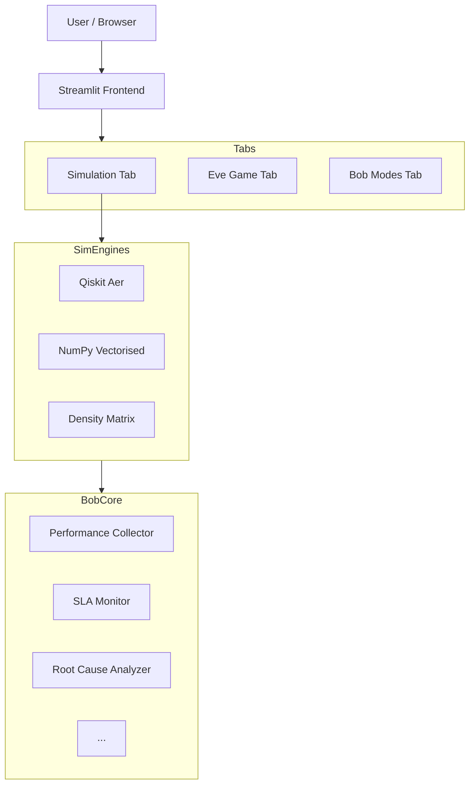
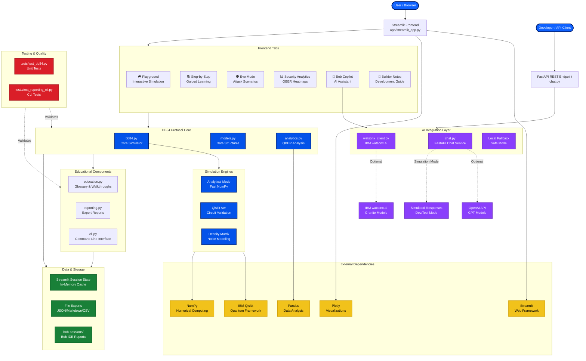

# BOB PROMPT: Generate Architecture Diagram (Mermaid) for BB84 QKD Educational Interface

## Role & Context

You are IBM Bob, my expert AI development partner. I have built **CryptoLab: BB84** – a full‑stack quantum key distribution educational tool with:

- Streamlit frontend (Simulation, Eve Game, Wizard, Bob Modes, Cross‑Layer, Cloud, Chat API tabs)
- Multiple simulation backends (Qiskit Aer, vectorised NumPy, density matrix)
- Project Bob performance observability (collectors, SLA monitors, root cause analyzers, fix recommenders, ROI projectors)
- Cloud infrastructure monitoring (CPU, memory, network, cost, auto‑scaling policies)
- Chat API performance tracking (latency, tokens, error rates)
- REST API (FastAPI) exposing all capabilities

I need a **clear, professional architecture diagram** that shows:
- All major components and their relationships
- Data flow (user → frontend → simulation → collectors → analysis → recommendations)
- External dependencies (IBM Qiskit, Streamlit, Plotly, etc.)
- Optional integrations (OpenAI API, cloud providers, GPU)

## Your Task

Generate a **Mermaid diagram** (```mermaid) that describes the system architecture. Use appropriate node shapes, subgraphs, and arrows. Include at least:

1. **User / Browser** – entry point
2. **Streamlit Frontend** – with its main tabs (Simulation, Eve Game, Wizard, Bob Modes, Cross‑Layer, Cloud, Chat API)
3. **Simulation Engines** – three boxes: Qiskit Aer, Vectorised (NumPy), Density Matrix
4. **Project Bob Core** – subgraph containing: Performance Collector, SLA Monitor, Root Cause Analyzer, Fix Recommender, Fix Simulator, ROI Projector
5. **Cloud Monitor** – subgraph: Cloud Collector, Cloud SLA Monitor, Cloud Fix Recommender, Auto‑Scaling Policy
6. **Chat API Monitor** – subgraph: Chat Collector, Chat SLA Monitor, Chat Fix Recommender, Capacity Planner
7. **External APIs** – OpenAI (optional), Simulated Chat API
8. **Data Storage** – session state, cache (Redis or in‑memory), benchmark results (CSV/JSON)
9. **REST API (FastAPI)** – optional, shown as a separate entry point for programmatic access

## Format

- Output only the Mermaid diagram inside a markdown code block.
- Use `flowchart TD` (top‑down) or `graph TD`.
- Add descriptive labels and comments using `%%`.
- Ensure the diagram is readable (not too dense; group related components in subgraphs).

## Example Structure



## Begin

Generate the architecture diagram now.

---

## GENERATED ARCHITECTURE DIAGRAM



## Diagram Explanation

### Architecture Layers

1. **Entry Points**
   - Browser users interact via Streamlit UI
   - Developers/scripts access via FastAPI REST endpoint

2. **Frontend Layer** (Streamlit)
   - 6 main tabs for different use cases
   - Playground for quick experiments
   - Wizard for guided learning
   - Eve Mode for security testing
   - Analytics for QBER visualization
   - Bob Copilot for AI assistance
   - Builder Notes for developers

3. **Protocol Core**
   - `bb84.py`: Main simulation engine
   - `models.py`: Typed data structures (RunConfig, ProtocolRun)
   - `analytics.py`: Parameter sweeps and QBER analysis

4. **Simulation Engines**
   - Analytical: Fast NumPy-based calculations
   - Qiskit Aer: Circuit-level quantum simulation
   - Density Matrix: Advanced noise modeling

5. **Educational Components**
   - Glossary and walkthrough content
   - Report generation (JSON/Markdown)
   - CLI for scripted simulations

6. **AI Integration**
   - IBM watsonx.ai client (optional)
   - FastAPI chat endpoint with OpenAI support
   - Local fallback for offline/demo mode

7. **Data Storage**
   - Session state for UI persistence
   - File exports for reports
   - Bob sessions folder for IDE reports

8. **Testing**
   - Unit tests for protocol correctness
   - CLI and reporting tests

9. **External Dependencies**
   - Qiskit for quantum simulation
   - Streamlit for web UI
   - Plotly for interactive charts
   - NumPy/Pandas for data processing

### Data Flow

1. User configures simulation parameters in Streamlit sidebar
2. Frontend calls BB84 protocol core with RunConfig
3. Core selects appropriate simulation engine
4. Engine executes BB84 protocol (Alice → Eve → Bob → Sifting → QBER)
5. Results flow back through analytics layer
6. Frontend renders visualizations and metrics
7. Optional: Bob Copilot provides AI explanations via watsonx.ai
8. Optional: Reports exported to files or API responses

### Key Design Principles

- **Separation of Concerns**: Protocol logic independent from UI
- **Extensibility**: Easy to add new simulation backends
- **Optional AI**: Works with or without external AI services
- **Developer-Friendly**: CLI, tests, and clear module boundaries
- **Educational Focus**: Multiple learning paths (playground, wizard, analytics)

This architecture supports the IBM Bob Hackathon goals by providing:
- Clear extension points for Bob-assisted development
- Modular design that Bob can understand and modify
- Multiple interfaces (UI, CLI, API) for different use cases
- Strong foundation for adding features like Qiskit validation mode